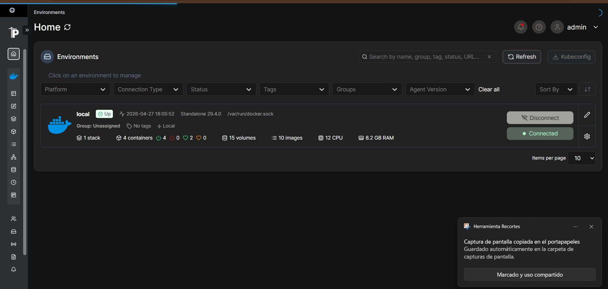
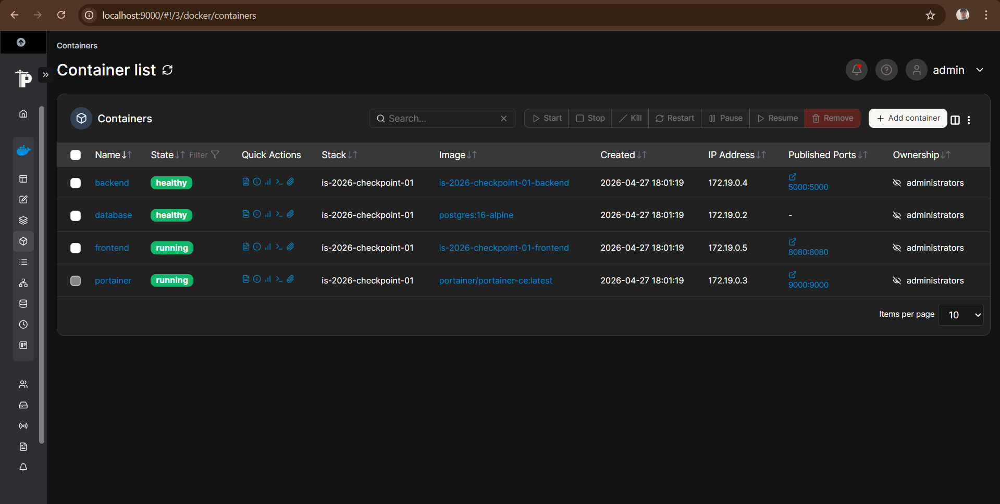

# TeamBoard App - Checkpoint 01

TeamBoard es una aplicación web funcional que muestra los integrantes del equipo, la feature que implementó cada uno y el estado de su servicio. Todo corre orquestado por Docker Compose.

## Equipo e Integrantes

| Nombre y Apellido | Legajo | Feature Asignada | Rol |
| :--- | :--- | :--- | :--- |
| Mateo Arturo Geffroy | 32.027 | Feature 01 y 04 | Coordinador e Infraestructura Base y Base de Datos |
| Luciana Martino | 30.499 | Feature 02 | Frontend |
| German Altamirano | 31.044 | Feature 03 | Backend |
| Benjamin Briones | 32.101 | Feature 05 | Portainer |

## Instrucciones de Ejecución

1. Clonar el repositorio:
   `git clone https://github.com/mateogeffroy/is-2026-checkpoint-01.git`
2. Configurar variables de entorno:
   Copiar el archivo `.env.example` y renombrarlo a `.env`. Completar las credenciales requeridas.
3. Levantar la infraestructura:
   Ejecutar `docker compose up -d --build` en la raíz del proyecto.
4. Acceder a los servicios:
   * **Frontend:** http://localhost:8080
   * **Backend API:** http://localhost:5000/api/health
   * **Portainer:** http://localhost:9000

## Descripción de Servicios
* **Frontend:** Página HTML servida por un servidor HTTP de Python.
* **Backend:** API REST con Python y Flask que se conecta a la base de datos.
* **Database:** Base de datos PostgreSQL 16.
* **Portainer:** Panel de monitoreo para los contenedores Docker.

---

## Feature 01 — Coordinación, Infraestructura Base y README

Se implementó la infraestructura completa del proyecto: la creación del repositorio en GitHub, la configuración del flujo de trabajo colaborativo con protección de ramas, y el archivo `docker-compose.yml` que orquesta los cuatro servicios de la aplicación.

### Responsabilidades del Coordinador

* Creación del repositorio público en GitHub con el nombre exacto `is-2026-checkpoint-01`.
* Configuración de **branch protection** en `main`: ningún integrante puede hacer push directo. Todo cambio ingresa mediante Pull Request revisado y aprobado.
* Invitación de todos los integrantes como colaboradores del repositorio.
* Creación de la estructura de carpetas inicial y el `.gitignore` base.
* Provisión del archivo `.env.example` con todas las variables de entorno necesarias para que cada integrante pueda configurar su entorno local.
* Revisión, coordinación y merge de los Pull Requests de cada feature.
* Verificación final de que `docker compose up` levanta todos los servicios sin errores.

### Archivos Principales

#### `docker-compose.yml`

Es el corazón de la infraestructura. Define, conecta y limita los cuatro servicios de la aplicación:

* **`frontend`** — Se construye desde `./frontend` (Feature 02). Expone el puerto `8080` hacia el host. Depende del servicio `backend` para arrancar después de él.
* **`backend`** — Se construye desde `./backend` (Feature 03). Expone el puerto `5000`. Lee sus credenciales de base de datos desde el archivo `.env` mediante `env_file`. Depende del HEALTHCHECK de `database` para arrancar después de él.
* **`database`** — Servicio PostgreSQL (Feature 04). No tiene puerto público expuesto al host: solo es accesible internamente a través de la red `teamboard_net`. Su configuración de imagen, variables de entorno, volumen persistente y healthcheck es responsabilidad de Feature 04.
* **`portainer`** — Panel de monitoreo Docker (Feature 05). Su imagen, puerto `9000` y volúmenes son configurados por Feature 05.

#### Red interna

Todos los servicios comparten la red `teamboard_net` de tipo `bridge`. Esto permite que se comuniquen entre sí por nombre de contenedor (por ejemplo, el backend se conecta a `database` como host) sin exponer puertos innecesarios al exterior.

#### Límites de recursos

Cada servicio tiene configurados límites explícitos de CPU y memoria en la sección `deploy.resources` para evitar que un contenedor consuma recursos excesivos del host:

| Servicio   | CPU       | Memoria |
| :--------- | :-------- | :------ |
| frontend   | 0.5 cores | 256 MB  |
| backend    | 0.5 cores | 256 MB  |
| database   | 1.0 core  | 512 MB  |
| portainer  | 0.5 cores | 256 MB  |

#### `.env` y `.env.example`

Las credenciales de la base de datos (usuario, contraseña, nombre de base de datos, host y puerto) se definen en el archivo `.env`, que **no se sube al repositorio** (está en `.gitignore`). El archivo `.env.example` actúa como plantilla con las claves necesarias pero sin valores reales, de modo que cualquier integrante pueda configurar su entorno local copiándolo y completándolo.

#### `.gitignore`

Excluye del repositorio todos los archivos que no deben versionarse.

### Dependencias entre Features

El `docker-compose.yml` refleja el orden de arranque y las dependencias funcionales de la aplicación:

* **Feature 04** (Database) debe estar lista antes de que el Backend pueda leer datos.
* **Feature 03** (Backend) debe estar activo antes de que el Frontend intente consultar la API.
* **Feature 02** (Frontend) depende de `backend` mediante `depends_on`.
* **Feature 05** (Portainer) opera de forma independiente y monitorea todos los contenedores.

---

## Feature 02 — Frontend (Página Web con HTML y JavaScript)

Se implementó la interfaz web de TeamBoard App: la pantalla principal que ve el usuario al ingresar al sistema. Desde esta página se puede visualizar el estado de conexión con el backend y una tabla con los integrantes del equipo, la feature asignada a cada uno, el servicio correspondiente y su estado.

### Configuración Técnica

* **Imagen base:** `python:3.12-slim` (versión ligera optimizada para reducir tamaño).
* **Servidor HTTP:** `python3 -m http.server` — servidor incluido en el intérprete de Python, sin dependencias adicionales.
* **Puerto:** 8080 (expuesto en `docker-compose.yml`).

### Endpoints Consumidos

#### 1\. GET `/api/health`

* **Descripción:** Verifica que el Backend está activo y respondiendo.
* **Uso:** El frontend consulta este endpoint al cargar la página para mostrar el indicador de estado de conexión.

#### 2\. GET `/api/team`

* **Descripción:** Obtiene la lista completa de integrantes del equipo.
* **Uso:** Con la respuesta, JavaScript construye la tabla de integrantes de forma dinámica. Si los datos cambian en la base de datos, se reflejan en la página sin modificar manualmente el HTML.

### Archivos Principales

#### `frontend/html/index.html`

Contiene la estructura visual de la página. Define el dashboard principal, el encabezado, la sección de estado del backend y la tabla de integrantes. Incorpora estilos CSS con diseño en modo oscuro. No contiene datos hardcodeados: toda la información de la tabla es inyectada por `app.js` en tiempo de ejecución.

#### `frontend/html/app.js`

Contiene la lógica del frontend. Se encarga de realizar las consultas al backend y actualizar la página con los datos recibidos:

1. Consulta `/api/health` para verificar el estado del backend y mostrar el indicador de conexión.
2. Consulta `/api/team` para obtener los datos del equipo.
3. Construye la tabla de integrantes de forma dinámica con JavaScript a partir de la respuesta JSON.

#### `frontend/Dockerfile`

Containeriza el frontend siguiendo buenas prácticas:

* Usa imagen slim (`python:3.12-slim`) para minimizar tamaño.
* Versión fija para garantizar reproducibilidad.
* Copia la carpeta `html/` dentro del contenedor.
* Expone el puerto 8080.
* Ejecuta `python3 -m http.server 8080` como proceso principal.

#### `frontend/.dockerignore`

Excluye archivos innecesarios de la imagen Docker:

* `.env` — las credenciales no deben copiarse a la imagen.
* `.git` — el control de versiones no es necesario en el contenedor.
* Archivos temporales y configuraciones locales del editor.

### Límites de Recursos

En `docker-compose.yml` se configuró:

* **CPU:** 0.5 cores
* **Memoria:** 256 MB

Esto previene que el Frontend consuma recursos excesivos del host.

### Dependencias

* Depende de: Feature 03 (Backend) — consume los endpoints `/api/health` y `/api/team`.
* Los datos mostrados provienen de Feature 04 (Database), accedidos indirectamente a través de la API Flask.
* Monitoreado por: Feature 05 (Portainer) — visualización del contenedor.

---

## Feature 03 — Backend (API REST con Flask)

Se implementó una API REST que actúa como intermediaria entre el frontend y la base de datos, proporcionando los datos del equipo de forma segura y estructurada.

### Configuración Técnica

* **Imagen base:** `python:3.12-slim` (versión ligera optimizada para reducir tamaño).
* **Framework:** Flask 3.0.2 — framework web minimalista para Python.
* **Driver de BD:** psycopg2-binary 2.9.9 — conector PostgreSQL para Python.
* **Servidor de aplicación:** Gunicorn 21.2.0 — servidor WSGI production-ready.
* **Puerto:** 5000 (expuesto en `docker-compose.yml`).

### Endpoints Disponibles

#### 1\. GET `/api/health`

* **Descripción:** Verifica que el servicio Backend está activo y respondiendo.
* **Respuesta:** `{"status": "healthy"}`
* **Uso:** Utilizado por Docker en el HEALTHCHECK para monitoreo automático.

#### 2\. GET `/api/team`

* **Descripción:** Devuelve la lista completa de integrantes del equipo.
* **Datos leídos desde:** Tabla `members` de PostgreSQL.
* **Respuesta esperada:**

```json
[
  {
    "id": 1,
    "nombre": "Juan",
    "apellido": "Pérez",
    "legajo": "12.345",
    "feature": "Feature XX",
    "servicio": "Frontend",
    "estado": "Activo"
  }
]
```

#### 3\. GET `/api/info`

* **Descripción:** Devuelve información y metadata del servicio Backend.
* **Respuesta:** `{"service": "backend", "version": "1.0.0", "description": "API para gestionar miembros del equipo"}`

### Conexión a la Base de Datos

El Backend se conecta a PostgreSQL utilizando las siguientes variables de entorno (definidas en `.env`):

* `POSTGRES_HOST` — Host del servidor PostgreSQL (default: `database`).
* `POSTGRES_DB` — Nombre de la base de datos.
* `POSTGRES_USER` — Usuario PostgreSQL.
* `POSTGRES_PASSWORD` — Contraseña de conexión.
* `POSTGRES_PORT` — Puerto PostgreSQL (default: `5432`).

> Nota: Las credenciales NO están hardcodeadas en el código fuente por razones de seguridad.

### Archivos Principales

#### `backend/app.py`

Aplicación principal Flask que:

* Define los 3 endpoints REST obligatorios.
* Gestiona la conexión a PostgreSQL con psycopg2.
* Habilita CORS para permitir solicitudes desde el Frontend.
* Retorna datos en formato JSON.

#### `backend/Dockerfile`

Containeriza el Backend siguiendo buenas prácticas:

* Usa imagen slim (`python:3.12-slim`) para minimizar tamaño.
* Versión fija para garantizar reproducibilidad.
* Copia `requirements.txt` primero para optimizar caché de capas Docker.
* Define usuario no-root para seguridad.
* Incluye HEALTHCHECK para monitoreo automático.
* Ejecuta con Gunicorn en puerto 5000.

#### `backend/.dockerignore`

Excluye archivos innecesarios de la imagen Docker:

* `.env` — las credenciales no deben copiarse a la imagen.
* `__pycache__` — bytecode compilado de Python.
* `.git` — el control de versiones no es necesario en el contenedor.

#### `backend/requirements.txt`

Define las dependencias Python requeridas:

* `Flask` — framework web para la API REST.
* `psycopg2-binary` — driver para conectar a PostgreSQL.
* `gunicorn` — servidor WSGI para producción.

### Límites de Recursos

En `docker-compose.yml` se configuró:

* **CPU:** 0.5 cores
* **Memoria:** 256 MB

Esto previene que el Backend consuma recursos excesivos del host.

### Dependencias

* Depende de: Feature 04 (Database) — requiere la tabla `members` en PostgreSQL.
* Utilizado por: Feature 02 (Frontend) — realiza fetch a `/api/team`.
* Monitoreado por: Feature 05 (Portainer) — visualización del contenedor.

---

## Feature 04 — Base de Datos (PostgreSQL)

Se implementó un motor de base de datos relacional para el almacenamiento persistente de la información de los integrantes del equipo. A diferencia del resto de los servicios, la base de datos no requiere un Dockerfile propio: se utiliza directamente la imagen oficial de PostgreSQL configurada desde el `docker-compose.yml`.

### Configuración Técnica

* **Imagen:** `postgres:16-alpine` (versión ligera basada en Alpine Linux).
* **Persistencia:** Se utiliza un volumen nombrado `pgdata` para asegurar que los datos no se pierdan al reiniciar o recrear los contenedores.
* **Red:** El servicio no expone ningún puerto al host. Es accesible únicamente de forma interna a través de la red `teamboard_net`, lo que reduce la superficie de ataque.
* **Healthcheck:** Se configuró una prueba de salud mediante `pg_isready` para garantizar que la base de datos esté lista antes de que el Backend intente conectarse.

### Variables de Entorno

La configuración del servicio se realiza a través de variables de entorno definidas en el archivo `.env` (nunca hardcodeadas en el `docker-compose.yml`):

* `POSTGRES_DB` — Nombre de la base de datos a crear al iniciar el contenedor.
* `POSTGRES_USER` — Usuario con permisos sobre esa base de datos.
* `POSTGRES_PASSWORD` — Contraseña del usuario PostgreSQL.

### Archivos Principales

#### `database/init.sql`

Script SQL que se ejecuta automáticamente la primera vez que el contenedor arranca. Realiza dos operaciones:

**1. Creación de la tabla `members`:**

```sql
CREATE TABLE IF NOT EXISTS members (
    id       SERIAL PRIMARY KEY,
    nombre   VARCHAR(100) NOT NULL,
    apellido VARCHAR(100) NOT NULL,
    legajo   VARCHAR(20)  NOT NULL,
    feature  VARCHAR(100) NOT NULL,
    servicio VARCHAR(100) NOT NULL,
    estado   VARCHAR(50)  NOT NULL
);
```

Cada columna representa un atributo del integrante: identificador autoincremental, nombre, apellido, legajo, feature asignada, servicio correspondiente y estado actual.

**2. Inserción de los registros del equipo:**

```sql
INSERT INTO members (nombre, apellido, legajo, feature, servicio, estado) VALUES
('Mateo Arturo', 'Geffroy', '32.027', 'Feature 01 y 04', 'Infraestructura / Base de Datos', 'En desarrollo'),
('Luciana',      'Martino', '30.499', 'Feature 02',      'Frontend',                        'En desarrollo'),
('German',       'Altamirano', '31.044', 'Feature 03',   'Backend',                         'En desarrollo'),
('Benjamin',     'Briones',    '32.101', 'Feature 05',   'Portainer',                       'En desarrollo');
```

Estos son los datos que el Backend lee al recibir una solicitud a `/api/team` y que el Frontend muestra en la tabla de integrantes.

### Límites de Recursos

En `docker-compose.yml` se configuró:

* **CPU:** 1.0 core
* **Memoria:** 512 MB

La base de datos recibe mayor asignación de recursos que el resto de los servicios, dado que es la capa de persistencia compartida por toda la aplicación.

### Dependencias

* Utilizada por: Feature 03 (Backend) — el backend ejecuta `SELECT * FROM members` para servir los datos al frontend.
* Monitoreada por: Feature 05 (Portainer) — visualización del contenedor.

---

## Feature 05 — Portainer

Se incorporó **Portainer** como servicio de administración y monitoreo de la infraestructura Docker del proyecto. Este servicio permite visualizar los contenedores levantados por `docker-compose.yml`, revisar su estado, consultar logs, inspeccionar recursos y administrar el entorno Docker desde una interfaz web.

Portainer queda disponible en `http://localhost:9000` una vez ejecutado `docker compose up -d --build`.

Se accede con las credenciales asignadas para la gestión del servicio una vez ingresado a la página.

### Configuración del servicio

En el archivo `docker-compose.yml` se declaró el servicio `portainer` con la siguiente configuración:

| Campo | Valor declarado | Descripción |
| :--- | :--- | :--- |
| `container_name` | `portainer` | Nombre fijo del contenedor para identificarlo fácilmente. |
| `image` | `portainer/portainer-ce:latest` | Imagen oficial de Portainer Community Edition utilizada para levantar el panel. |
| `ports` | `9000:9000` | Expone el puerto `9000` del contenedor en el puerto `9000` del host. |
| `volumes` | `/var/run/docker.sock:/var/run/docker.sock` | Permite que Portainer se comunique con el Docker Engine del host y pueda listar y administrar contenedores. |
| `volumes` | `portainer_data:/data` | Volumen persistente donde Portainer guarda su configuración interna. |
| `networks` | `teamboard_net` | Conecta Portainer a la misma red interna que el resto de los servicios. |
| `deploy.resources.limits.cpus` | `0.5` | Limita el uso máximo de CPU del contenedor. |
| `deploy.resources.limits.memory` | `256M` | Limita la memoria máxima disponible para el contenedor. |

### Variables y volúmenes declarados

El servicio `portainer` **no requiere variables de entorno propias** ni utiliza el archivo `.env`. Su configuración se realiza directamente desde los campos declarados en `docker-compose.yml`.

Además, se declaró el volumen global:

* **`portainer_data`** — Volumen persistente utilizado por Portainer para conservar usuarios, configuración inicial, endpoints y datos internos aun cuando el contenedor sea recreado.

También se monta el socket de Docker del host:

* **`/var/run/docker.sock`** — Archivo especial que permite a Portainer comunicarse con Docker. Gracias a este montaje, Portainer puede detectar y monitorear los contenedores `frontend`, `backend`, `database` y `portainer`.

### Rol dentro de la arquitectura

Portainer no forma parte del flujo funcional de la aplicación TeamBoard, por lo que no es una dependencia directa del frontend, backend o base de datos. Su rol es operativo: brindar una herramienta visual para supervisar los servicios, verificar su estado y facilitar tareas de administración durante el desarrollo y la demostración del checkpoint.

### Evidencia visual

Vista del entorno local conectado desde Portainer:





Lista de contenedores detectados por Portainer, incluyendo `frontend`, `backend`, `database` y `portainer`.